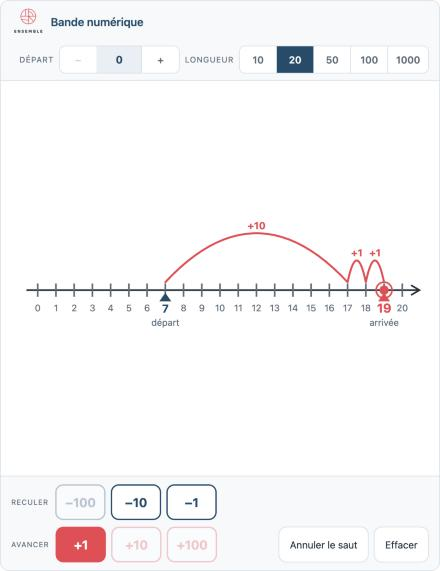

# Extensions Ensemble pour OpenBoard

Des outils de classe à glisser sur le tableau, pour [OpenBoard](https://openboard.ch).
Chacun est une application web au format `.wgt` : rien à installer, rien à compiler,
un dossier à copier.

Testé sur **OpenBoard 1.6.4 sous Windows**. Le format étant le même partout,
ces extensions devraient fonctionner sous Linux et macOS, mais ça n'a pas été vérifié.

---

## Les extensions

### Bande numérique



Une bande graduée pour calculer en avançant, devant la classe.

- **Poser le départ d'un clic** n'importe où sur la bande.
- **Avancer et reculer** par unité, par dizaine ou par centaine.
- **Chaque saut reste dessiné**, en arc au-dessus de la bande, avec sa valeur.
  L'élève voit son chemin, pas seulement un résultat : un saut de 5 puis un de 1
  et six sauts de 1 donnent le même nombre, et la différence se voit à l'œil nu.
- **La bande ne commence pas forcément à zéro** : son début se règle de dix en dix.
- **Cinq longueurs** — 10, 20, 50, 100, 1000. Changer la longueur ne touche à
  aucune valeur posée, on redessine seulement.
- Sur les bandes de 10 et de 20, **tous les nombres sont écrits**. Elles sont
  faites pour être lues.
- **Annuler le dernier saut**, et effacer pour repartir.

Le départ est marqué en bleu sous l'axe, l'arrivée en rose, de la même façon :
les deux se lisent d'un coup d'œil depuis le fond de la classe. Il n'y a
volontairement aucun bandeau du type « vous êtes sur 19 » — le chiffre écrit
ferait à la classe le travail de lecture qu'on lui demande.

---

## Installer

Pas besoin des droits administrateur.

1. Télécharger ce dépôt : bouton **Code → Download ZIP**, puis décompresser.
2. Fermer OpenBoard.
3. Dans l'explorateur Windows, coller cette adresse dans la barre du haut :
   ```
   %localappdata%\OpenBoard\interactive content
   ```
   Si le dossier n'existe pas, le créer.
4. Y copier le dossier **`bande-numerique.wgt`** entier — le dossier lui-même,
   pas son contenu, et sans le renommer.
5. Rouvrir OpenBoard.

L'extension apparaît alors dans la palette de droite, onglet **Applications**,
à côté de la calculatrice. On la fait glisser sur la page, on la redimensionne,
on s'en sert. Sur une autre page, on la glisse à nouveau.

> L'autre emplacement possible, `Program Files\OpenBoard\library\applications`,
> demande les droits administrateur **et** se vide à chaque réinstallation
> d'OpenBoard. Celui ci-dessus survit aux mises à jour.

Sous Linux : `~/.local/share/OpenBoard/interactive content`.
Sous macOS : `~/Library/Application Support/OpenBoard/interactive content`.

---

## Développer une extension

Une extension OpenBoard est un dossier suffixé `.wgt` contenant trois fichiers :

```
mon-extension.wgt/
├── config.xml     ce qu'OpenBoard lit pour la palette
├── icon.png       la vignette
└── index.html     la page, CSS et JavaScript compris
```

Aucun fork d'OpenBoard, pas de Qt, pas de C++ : c'est une page web.

- Poser le dossier dans `interactive content`, lancer OpenBoard, glisser
  l'extension sur le tableau.
- **Clic droit sur l'extension → Recharger** après chaque modification.
- **Clic droit → Inspecteur web** ouvre un vrai inspecteur : on développe dedans.

Trois contraintes apprises à l'usage, qui valent pour toute extension :

**Pas de ressource distante.** Ni police Google, ni CDN, ni image hébergée
ailleurs : une salle de classe n'a pas toujours internet, et quand elle l'a, elle
l'a lent. Ici le logo est encodé en data URI dans la page, et la typographie
s'appuie sur les polices du système.

**Un JavaScript conservateur.** Le moteur n'est pas le navigateur du poste mais
celui du Qt embarqué dans la version d'OpenBoard installée, dont on ignore
l'année. La bande numérique se replie sur `mousedown` et `touchstart` quand les
événements de pointeur manquent.

**Jamais de navigation dans l'extension.** Un lien suivi en place remplacerait
l'outil par une page web, en pleine leçon, sans retour possible. Le lien du logo
annule toujours le comportement par défaut et tente une nouvelle fenêtre ; si
elle ne s'ouvre pas, il ne se passe rien, et c'est le bon échec.

### Mémoire des réglages

L'état se garde avec l'API d'OpenBoard :

```js
window.sankore.setPreference(cle, valeur);        // des chaînes de caractères
window.sankore.preference(cle, defaut, rappel);
```

Cette API a changé selon les versions. La bande numérique accepte les deux
formes — le retour direct de l'ancienne et le rappel de la nouvelle — avec un
repli au bout de 300 ms, et fonctionne sans rien quand `window.sankore` n'existe
pas. C'est ce qui permet d'ouvrir `index.html` dans un navigateur ordinaire pour
travailler sans lancer le tableau.

---

## À propos

Ces extensions accompagnent [Ensemble](https://www.app-ensemble.fr), l'outil de
plans de travail et de ceintures de compétences.

## Licence

Le code est sous [licence MIT](LICENSE) : reprenez-le, modifiez-le, distribuez-le,
y compris pour un usage commercial, à la seule condition de conserver la mention
de copyright. Aucune garantie n'est donnée.

La licence porte sur le code. **Le nom et le logo Ensemble restent la propriété
de vroad studio** : reprendre la bande numérique pour en faire autre chose, oui ;
se présenter comme Ensemble, non. Si vous publiez une version dérivée, remplacez
le logo du bandeau par le vôtre.
